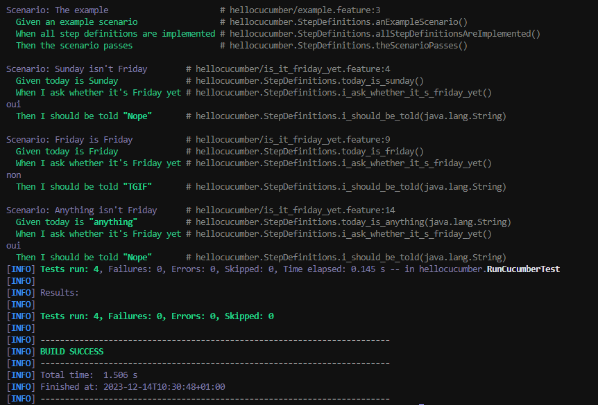
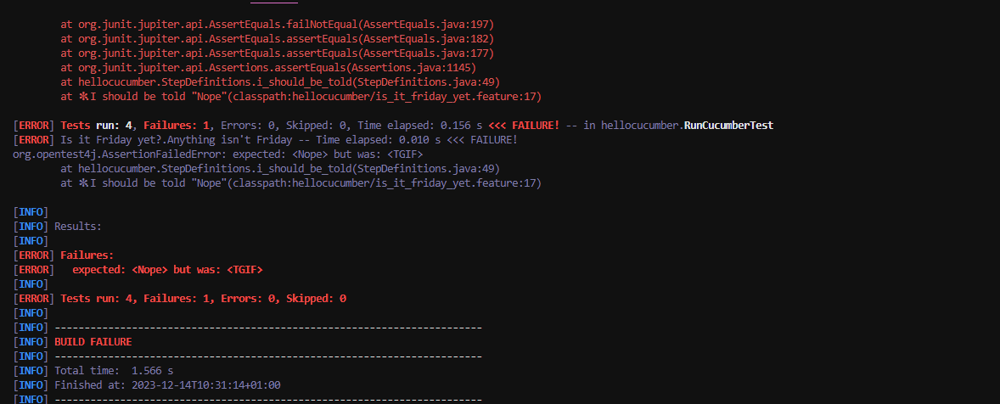

= R5.A.08 -- Dépôt pour les TPs
:icons: font
:MoSCoW: https://fr.wikipedia.org/wiki/M%C3%A9thode_MoSCoW[MoSCoW]

Ce dépôt concerne les rendus de mailto:andrew.phakeovilay@etu.univ-tlse2.fr[Andrew Phakeovilay].

== TP1

.Exemple de code
[source,java]
---
@Given("today is Sunday")
public void today_is_sunday() {
    // Write code here that turns the phrase above into concrete actions
    throw new io.cucumber.java.PendingException();
}
---

.Exemple d'image insérée en asciidoc
image::artifacts-r303.svg[width=80%]

.is_it_friday_yet.feature
[source, feature]
---
Feature: Is it Friday yet?
  Everybody wants to know when it's Friday
  Scenario: Sunday isn't Friday
    Given today is Sunday
    When I ask whether it's Friday yet
    Then I should be told "Nope"
  Scenario: Friday is Friday
    Given today is Friday
    When I ask whether it's Friday yet
    Then I should be told "TGIF"
  Scenario: Anything isn't Friday 
    Given today is "anything"
    When I ask whether it's Friday yet
    Then I should be told "Nope"
---

.Succès de tous les tests

.Cas où anything est Friday

== TP2...
